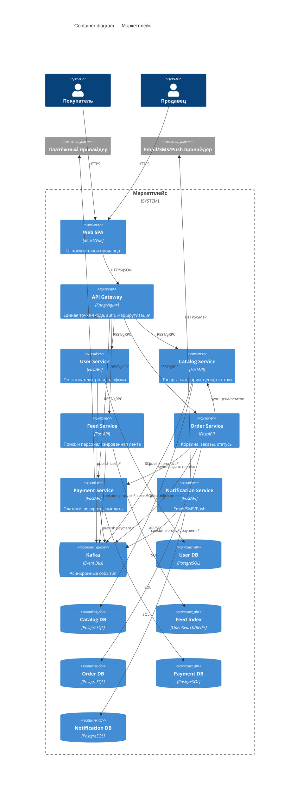

# Маркетплейс

## 1. C4 Container



---

## 2. Домены и ответственность

| Домен | Ответственность |
|---|---|
| Пользователи | Регистрация, auth, профили, роли покупатель/продавец |
| Каталог | Товары, категории, цены, остатки, управление продавцом |
| Поиск и лента | Поиск, персонализация, ранжирование |
| Заказы | Корзина, оформление, жизненный цикл, статусы |
| Платежи | Оплата, транзакции, возвраты, выплаты |
| Уведомления | Шаблоны, отправка, статусы доставки |

---

## 3. Распределение доменов по сервисам

| Сервис | Домен | Почему отдельно |
|---|---|---|
| User Service | Пользователи | Свой жизненный цикл, редко меняется |
| Catalog Service | Каталог | Много чтения, отдельное управление продавцом |
| Feed Service | Поиск и лента | Нужен индекс и масштабирование чтения |
| Order Service | Заказы | Транзакционный домен |
| Payment Service | Платежи | Изоляция финансов и интеграций |
| Notification Service | Уведомления | Асинхронный, легко масштабируется |

---

## 4. Владение данными

| Сервис | Данные | Хранилище |
|---|---|---|
| User | users, roles, seller_profiles | PostgreSQL |
| Catalog | products, categories, prices, stock | PostgreSQL |
| Feed | search_index, user_features | OpenSearch/Redis |
| Order | carts, orders, order_items | PostgreSQL |
| Payment | payments, refunds, payouts, ledger | PostgreSQL |
| Notification | notifications, templates | PostgreSQL |

Общих БД между сервисами нет — каждый владеет своим хранилищем. Обмен — только через API и события.

---

## 5. Взаимодействия

**Синхронные (REST/gRPC):**
- Клиент → API Gateway → User / Catalog / Feed / Order / Payment
- Order → Catalog — проверка цены и остатка
- Order → Payment — создание платежа
- Payment → внешний PSP
- Notification → внешний провайдер

**Асинхронные (Kafka):**
- Catalog, User, Order, Payment публикуют события `product.*`, `user.*`, `order.*`, `payment.*`
- Feed потребляет `product.*`, `user.*`, `order.*`
- Notification потребляет `order.*`, `payment.*`

---

## 6. Альтернативы и trade-off'ы

**A. Модульный монолит**
- ➕ Простой деплой, ACID-транзакции, меньше инфраструктуры
- ➖ Сложно масштабировать отдельные части, единый blast radius
- Trade-off: простота против масштабируемости и изоляции

**B. Микросервисы по доменам (выбран)**
- ➕ Независимое масштабирование, изоляция сбоев, автономия команд
- ➖ Распределённая сложность, eventual consistency, observability
- Trade-off: гибкость против сложности эксплуатации

**C. Укрупнённые сервисы** (Identity / Commerce / Engagement / Payment)
- ➕ Меньше сервисов, проще эксплуатация
- ➖ Связанность доменов, общий blast radius
- Trade-off: меньше частей против меньшей изоляции

---

## 7. Обоснование выбора

Выбран вариант B. Требования явно разделяют домены с разным профилем нагрузки: лента/поиск (много чтения, отдельный индекс), платежи (изоляция, безопасность), заказы (транзакции), уведомления (асинхронность). Микросервисы дают независимое масштабирование и изоляцию сбоев; сложность компенсируется Kafka и отдельными БД.

---

## 8. Что реализовано в репозитории

Поднят **один сервис** — `catalog-service` с health-check, демонстрирующий запуск в Docker.

### Структура

```
marketplace-architecture/
├── README.md
├── docker-compose.yml
├── .dockerignore
├── .gitignore
└── services/
    └── catalog-service/
        ├── Dockerfile
        ├── requirements.txt
        └── app/
            └── main.py
```

### Проверено

```
$ docker compose ps
NAME              IMAGE                                      STATUS
catalog-service   marketplace-architecture-catalog-service   Up (healthy)   0.0.0.0:8000->8000/tcp

$ curl -i http://localhost:8000/health
HTTP/1.1 200 OK
content-type: application/json

{"status":"ok","service":"catalog-service"}
```

---

## 9. Запуск

Требуется Docker и Docker Compose.

```bash
docker compose up --build
```

Проверка:

```bash
curl -i http://localhost:8000/health
```

Ожидаемый ответ: `HTTP/1.1 200 OK`, тело `{"status":"ok","service":"catalog-service"}`.

Проверка статуса контейнера:

```bash
docker compose ps
```

Ожидаемо: `Up (healthy)`.

Остановка:

```bash
docker compose down
```